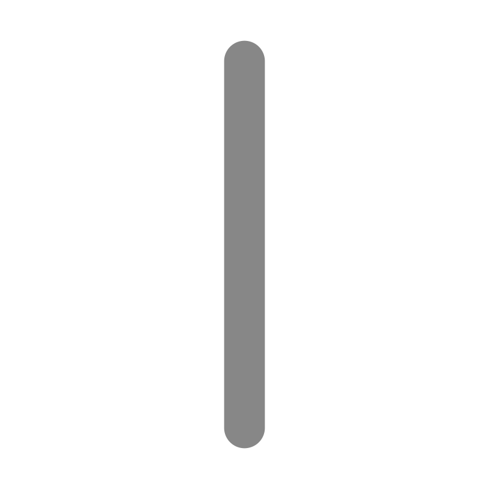
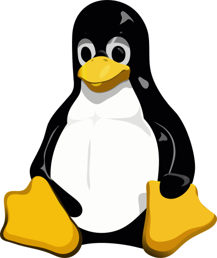
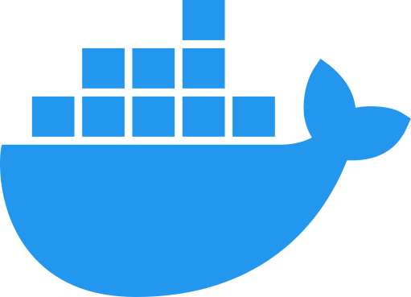
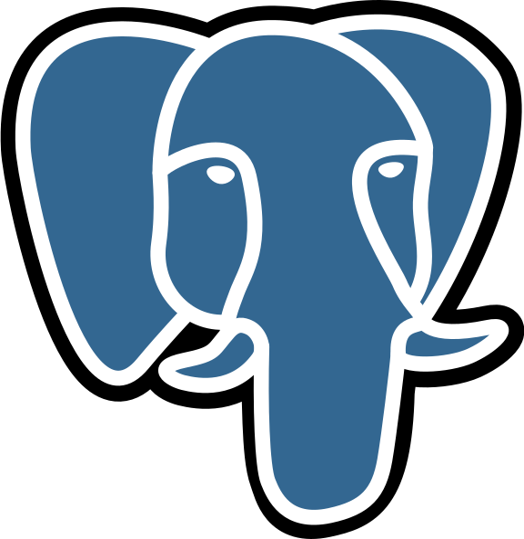
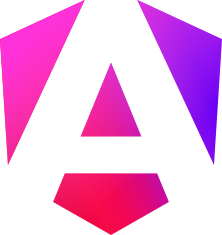
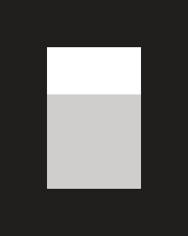

<h2 align="center">U-N-A-I</h3>
<h4 align="center">Desarrollador de software</h4>
<h5 align="center">Construir cosas que sean sencillas, rápidas y útiles.</h5>

---

<pre>
┌──────────────────────────────────────────────────────────────────┐
 🌱 Reforzando fundamentos de software y aprendiendo sobre IA 
 🔭 Software · Sistemas · IA                                 
 📫 work.alias.unsaved790@passmail.net                       
└──────────────────────────────────────────────────────────────────┘
</pre>

---

 

Ver más 👀

## Sobre mí

Hola 👋, soy desarrollador de software enfocado en la construcción de productos,con experiencia en frontend y backend.

Mi formación y experiencia me han llevado a trabajar con diferentes tecnologías y paradigmas, principalmente en el ámbito del desarrollo web.

## Tour

Si has llegado hasta aquí, probablemente quieras saber qué puedes encontrar en mi GitHub.

Tengo una organización llamada [Ikastoki](https://github.com/Ikastoki), donde agrupo proyectos, ejercicios y material de aprendizaje de distintas etapas de mi recorrido en el desarrollo de software.

Dentro de Ikastoki encontrarás:

* [Roadmap](https://github.com/Ikastoki/roadmap) — proyectos, ejercicios y material de etapas anteriores(DAW-DAM).
* [Pillars](https://github.com/Ikastoki/pillars) — Una guía que busca construir una base sólida, que permita comprender diferentes tecnologías y aplicarlas de forma transversal.
* [Logic](https://github.com/Ikastoki/logic) — Retos de lógica de programación.
* [Exercises]() — Ejercicios y retos de diferentes plataformas.
* [Hugging Java](https://github.com/Ikastoki/hugging-java) — Desarrollador/a Full Stack {Java}
* [Plan B](https://github.com/Ikastoki/plan-b) — Repositorio de transición(posible) a Automatización y Robótica Industrial.

> [!NOTE]
>
> Mi perfil personal recoge proyectos y herramientas que desarrollo por interés propio o trabajo, mientras que Ikastoki está pensado como un espacio separado para el aprendizaje, la experimentación y la documentación del proceso.

## Stack

 

 
 

 

---

---

  

